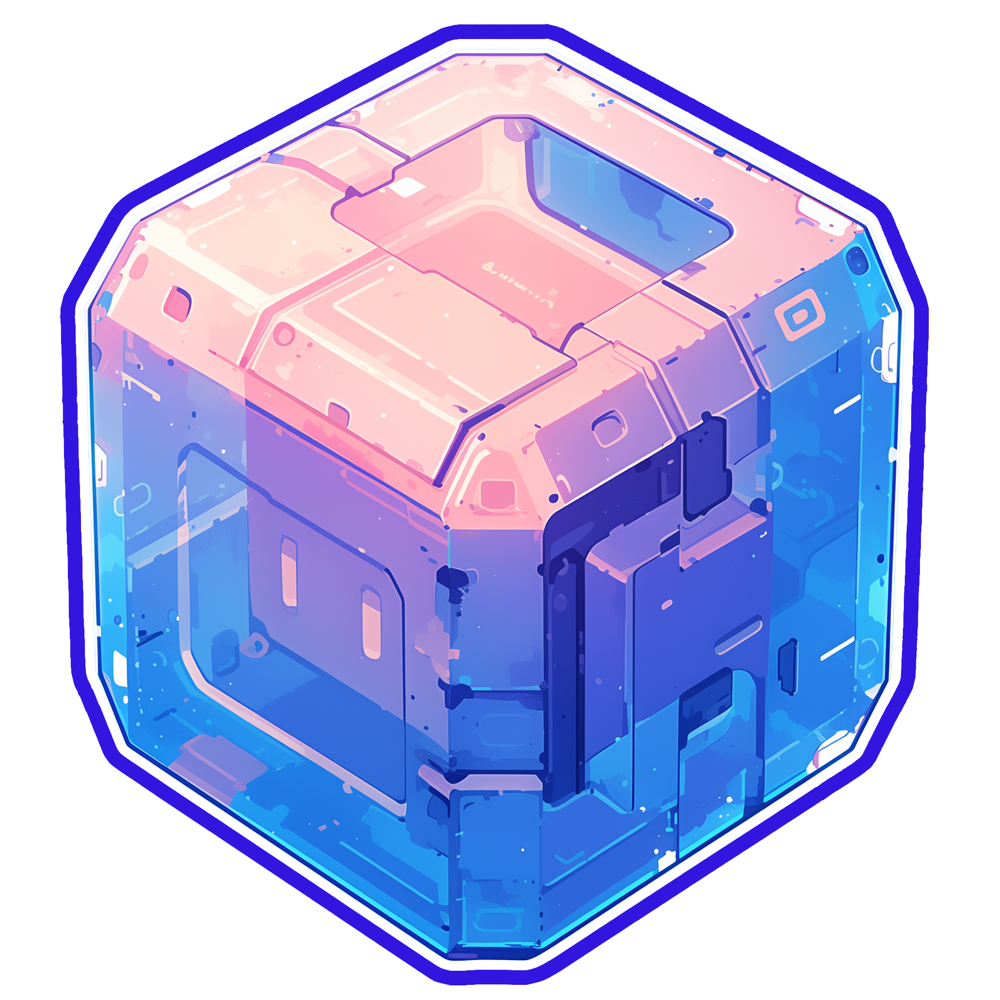

<p align="center"></p>

<h1 align="center">도트 런처</h1>

<em><h5 align="center">('Electron Launcher'를 계승한 프로젝트)</h5></em>

[<p align="center">](https://github.com/K-SeongWon/DoteuLauncher/actions) [](https://github.com/K-SeongWon/DoteuLauncher/releases) </p>

<p align="center">자바, 포지, 패브릭 그리고 기타 여러 모드들 설치하기 힘드셨나요?
아무 걱정말고 마인크래프트 모드 서버에 참여하세요.
설치는 '도트 런처'가 대신 해드립니다.</p>


## 특징

* 🔒 편리한 계정관리
  * 여러 계정을 추가하고, 편리하게 변경하세요.
  * Microsoft (OAuth 2.0) 그리고, Mojang (Yggdrasil) 인증을 완벽하게 지원합니다.
  * 계정 자격증명은 절대 저장되지 않고, Mojang으로 직접 전달됩니다.
* 📂 효율적인 파일관리
  * 클라이언트 업데이트가 공개되는 즉시 받아보세요.
  * 파일들은 실행전에 검증 과정을 거칩니다. 손상되거나 잘못된 파일은 다시 다운로드 됩니다.
* ☕ **자동 Java 버전 확인**
  * 호환되지 않는 Java 버전이 설치되어 있다면, 올바른 버전으로 설치해 드립니다.
  * 런처를 실행하기 위해 Java를 직접 설치할 필요가 없습니다.
* 📰 서버 뉴스 피드 내장
* ⚙️ Java 제어판을 포함한, 직관적인 설정 메뉴
* 🌏 모든 마인크래프트 서버 지원
  * 참여할 서버를 손쉽게 전환할 수 있습니다.
  * 선택한 서버의 플레이어수를 확인할 수 있습니다.
* 📡 자동 업데이트
  * 도트 런처는 스스로 업데이트 됩니다
*  모장 서비스 상태를 확인할 수 있습니다.

이게 전부가 아닙니다. 런처를 설치해서 직접 확인해보세요!

#### 도움이 필요하신가요? [위키를 확인하세요.][wiki]

#### 프로젝트가 마음에 드신다면, 리포지토리에 ⭐ 별을 남겨주세요!

## 다운로드

[GitHub 릴리즈](https://github.com/K-SeongWon/DoteuLauncher/releases)에서 다운로드 하실 수 있습니다.

#### 최신 릴리즈

[](https://github.com/K-SeongWon/DoteuLauncher/releases/latest)

#### 최신 프리-릴리즈
[](https://github.com/K-SeongWon/DoteuLauncher/releases)

**지원하는 플랫폼**

[릴리즈](https://github.com/K-SeongWon/DoteuLauncher/releases)탭에서 다운로드 하신다면, 여러분의 환경에 맞는 설치파일을 다운로드 & 설치하세요.

| Platform | File |
| -------- | ---- |
| 윈도우 x64 | `Helios-Launcher-setup-VERSION.exe` |
| 맥OS x64 | `Helios-Launcher-setup-VERSION-x64.dmg` |
| 맥OS arm64 | `Helios-Launcher-setup-VERSION-arm64.dmg` |
| 리눅스 x64 | `Helios-Launcher-setup-VERSION.AppImage` |

## 콘솔(개발자 도구)

아래 키보드 단축키를 통해, 콘솔(개발자 도구)을 실행하세요.

```console
ctrl + shift + i
```

#### 🚨 주의
* 콘솔 탭이 선택돼 있는지 잘 확인하세요.
* 하고자 하는 작업이 뭔지, 명령어가 정확한지 100% 확신할 수 없다면, 절대 아무거나 붙여넣지 마세요.
* 잘못된 명령어를 붙여넣으면 민감한 정보가 노출될 수 있습니다.

#### 콘솔 내용을 파일로 내보내기

콘솔 출력을 파일로 내보내고 싶다면, 콘솔의 아무곳이나 우클릭하고 **Save as (다른 이름으로 저장)**을 클릭하세요. 원하는 위치와 파일명을 정하고 저장하시면 됩니다.


## 개발

이 섹션에서는 개발 환경에 대해 설명합니다.

### 시작하기

**시스템 요구 사항**

* [Node.js][nodejs] v20

---

**종속성 복제 및 설치**

```console
> git clone https://github.com/K-SeongWon/DoteuLauncher.git
> cd DoteuLauncher
> npm install
```

---

**개발 환경에서 런처 실행**

```console
> npm start
```

---

**런처 설치파일 빌드하기**

개발 환경과 동일한 플랫폼 용 설치파일 빌드하기.

```console
> npm run dist
```

특정 플랫폼 용 설치파일 빌드하기.

| Platform    | Command              |
| ----------- | -------------------- |
| 윈도우 x64 | `npm run dist:win`   |
| 맥OS       | `npm run dist:mac`   |
| 리눅스 x64   | `npm run dist:linux` |

맥OS용 빌드는 윈도우 / 리눅스 및 기타 환경에서 제대로 실행되지 않을 수 있습니다.

---

### 비주얼 스튜디오 코드 (VS Code)

런처의 모든 개발은 [비주얼 스튜디오 코드 (VS Code)][vscode]를 사용해야 합니다.

다음 내용을 `.vscode/launch.json` 에 붙여넣으세요.

```JSON
{
  "version": "0.2.0",
  "configurations": [
    {
      "name": "Debug Main Process",
      "type": "node",
      "request": "launch",
      "cwd": "${workspaceFolder}",
      "program": "${workspaceFolder}/node_modules/electron/cli.js",
      "args" : ["."],
      "outputCapture": "std"
    },
    {
      "name": "Debug Renderer Process",
      "type": "chrome",
      "request": "launch",
      "runtimeExecutable": "${workspaceFolder}/node_modules/.bin/electron",
      "windows": {
        "runtimeExecutable": "${workspaceFolder}/node_modules/.bin/electron.cmd"
      },
      "runtimeArgs": [
        "${workspaceFolder}/.",
        "--remote-debugging-port=9222"
      ],
      "webRoot": "${workspaceFolder}"
    }
  ]
}
```

이렇게 하면 두 가지 디버그 구성이 추가됩니다.

#### Debug Main Process (디버그 메인-프로세스)

런처의 [메인 프로세스][mainprocess]를 디버깅 할 수 있습니다. [렌더러 프로세스][rendererprocess]에서 스크립트를 디버깅 하려면, 개발자 도구 창을 여세요.

#### Debug Renderer Process (디버그 렌더러-프로세스)

런처의 [렌더러 프로세스][rendererprocess]를 디버깅 할 수 있습니다. [크롬 용 디버거][chromedebugger]확장 프로그램을 필요로 합니다.

이 디버그 구성을 사용하는 동안에는 개발자 도구 창을 **열 수 없습니다.** 크롬은 하나의 디버거만 허용하며, 다른 디버거를 실행할 경우 프로그램이 중단됩니다.

---

### 제3자 사용을 위한 권고

원작자에 대한 크레딧을 표기하고, 원본 출처에 대한 링크를 남겨주세요.
무료 소프트웨어인 만큼 최소한의 지원을 부탁드립니다.

Microsoft 인증 설정에 대한 지침은 https://github.com/dscalzi/HeliosLauncher/blob/master/docs/MicrosoftAuth.md 을 참조하세요.

---

## 리소스

* [Wiki][wiki]
* [Nebula (서버 접속정보 'Distribution.json'생성을 위한 프로그램)][nebula]
* [v2 Rewrite Branch (비활성)][v2branch]

원본 개발자에게 연락하는 가장 좋은 수단은 'Discord(디스코드)'입니다.

[][discord]

---

### 마인크래프트 월드에서 뵙겠습니다.


[nodejs]: https://nodejs.org/en/ 'Node.js'
[vscode]: https://code.visualstudio.com/ 'Visual Studio Code'
[mainprocess]: https://electronjs.org/docs/tutorial/application-architecture#main-and-renderer-processes 'Main Process'
[rendererprocess]: https://electronjs.org/docs/tutorial/application-architecture#main-and-renderer-processes 'Renderer Process'
[chromedebugger]: https://marketplace.visualstudio.com/items?itemName=msjsdiag.debugger-for-chrome 'Debugger for Chrome'
[discord]: https://discord.gg/zNWUXdt 'Discord'
[wiki]: https://github.com/dscalzi/HeliosLauncher/wiki 'wiki'
[nebula]: https://github.com/dscalzi/Nebula 'dscalzi/Nebula'
[v2branch]: https://github.com/dscalzi/HeliosLauncher/tree/ts-refactor 'v2 branch'
